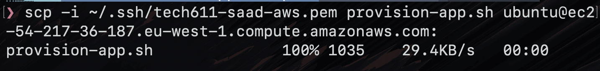

# Tic Tac Toe Application

- [Tic Tac Toe Application](#tic-tac-toe-application)
  - [Dependencies](#dependencies)
  - [Getting the script onto the VM](#getting-the-script-onto-the-vm)
    - [Method 1 – SCP](#method-1--scp)
    - [Method 2 – Git](#method-2--git)
  - [Preparing the VM](#preparing-the-vm)
  - [Running the Application](#running-the-application)
  - [Reverse Proxy Configuration](#reverse-proxy-configuration)
  - [Deployment Script Steps](#deployment-script-steps)
  - [2-tier deployment](#2-tier-deployment)
    - [Manual deployment of database](#manual-deployment-of-database)
    - [Deployment of database with bash script](#deployment-of-database-with-bash-script)
  - [User Data](#user-data)
    - [what to expect when using user data on the vm](#what-to-expect-when-using-user-data-on-the-vm)
  - [VM Images \& AMIs](#vm-images--amis)

The deployment process for the app involves:

- Installing the required software.
- Getting the application code onto the VM.
- Installing the application’s dependencies.
- Starting the application with pm2.
- 
## Dependencies

The following software is required on the VM:

* Ubuntu – operating system for the VM
* Git – used to clone the application repository
* Nginx – web server, a reverse proxy is configured to allow users to access the app from port 80
* Node.js 20 – required to run the application
* npm – Node.js package manager, used to install the application’s dependencies
* PM2 - used to return control of the terminal back to the user

The Node.js dependencies are installed using:

npm install

This reads the application’s package.json file and installs the required packages into node_modules.


## Getting the script onto the VM

There are two methods used to transfer the script onto the VM.

### Method 1 – SCP

The script can be copied from the local computer to the VM using scp.

For example:
```bash
scp -i ~/.ssh/your-key.pem prov-app.sh ubuntu@<VM-IP>:~
```
This uses the SSH private key to authenticate with the VM and copies app.zip into the Ubuntu user’s home directory.

Example of the SCP method:



### Method 2 – Git

The application and script can also be downloaded directly onto the VM from GitHub. 

The deployment script itself uses this method to download the app code:
```bash
git clone https://github.com/psyss24/tech611-ttt
cd tech611-ttt
```

## Preparing the VM

The deployment script first updates the package lists and installed packages:
```bash
sudo apt-get update
sudo apt-get upgrade -y
```
Nginx is then installed:
```bash
sudo apt-get install nginx -y
```
Node.js 20 is installed using NodeSource:

``` bash
curl -sL https://deb.nodesource.com/setup_20.x -o nodesource_setup.sh
sudo bash nodesource_setup.sh
sudo apt install nodejs
```
The installed version can be checked with:
```bash
node -v
```
Finally, the application’s dependencies are installed:
```bash
npm install
```

## Running the Application

From inside the application’s directory, our script uses PM2; PM2 runs the application as a managed background process, so the terminal is returned to the user while the application continues running.

After cloning the repo and moving into the correct directory, our script will run:
```bash
pm2 stop app
```
This command makes sure that if the app was previously running, it will now stop; if the app was not running the command fails and the script moves onto to the next step:
```bash
pm2 start npm --name "app" -- start
```
This tells pm2 to run the npm start command (which itself is defined in the package.json file in the app directory), this process will have the name “app”. We name the process app in this case so that if the script is ran again, the earlier command of ```pm2 stop app``` will stop this particular process ensuring idempotency.

## Reverse Proxy Configuration

We modify the default proxy configuration to forward requests recieved from port 80 to the node application running on port 3000 so that users can access the application through nginx without directly accesssing port 3000 itself; this is done by replacing one line on the default config file:
```bash
sudo sed -i 's|try_files $uri $uri/ =404;|proxy_pass http://127.0.0.1:3000;|' /etc/nginx/sites-available/default
```
The config is then reloaded:
```bash
sudo systemctl reload nginx
```
## Deployment Script Steps

The script:

1. Updates the Ubuntu package lists
2. Upgrades installed packages
3. Installs Nginx
4. Downloads the NodeSource setup script
5. Installs Node.js 20
6. Installs PM2 globally.
7. Clones the application repository from GitHub
8. Pulls the latest application changes
9. Enters the application directory
10. Installs the application’s npm dependencies
11. Configures Nginx as a reverse proxy
12. Reloads Nginx
13. Stops any existing PM2 process named app
14. Starts the application using PM2

This allows a newly prepared VM to be configured and have the application started using a single script.


## 2-tier deployment
### Manual deployment of database
We can also deploy the app on a vm whilst deploying the database on a seperate VM; though here we will need to ensure that the database can only receive traffic from our app VM so this will need to be configured in the db VM's security group.

We need to install the mongo db gpg key via:
```bash
curl -fsSL https://pgp.mongodb.com/server-8.2.asc | \
   sudo gpg -o /usr/share/keyrings/mongodb-server-8.2.gpg \
   --dearmor
```
before updating the source list and installing mongo db:
```bash
echo "deb [ arch=amd64,arm64 signed-by=/usr/share/keyrings/mongodb-server-8.0.gpg ] https://repo.mongodb.org/apt/ubuntu noble/mongodb-org/8.2 multiverse" | sudo tee /etc/apt/sources.list.d/mongodb-org-8.2.list

sudo apt-get update


sudo apt-get install -y \
    mongodb-org=8.2.5 \
    mongodb-org-database=8.2.5 \
    mongodb-org-server=8.2.5 \
    mongodb-mongosh \
    mongodb-org-shell=8.2.5 \
    mongodb-org-mongos=8.2.5 \
    mongodb-org-tools=8.2.5 \
    mongodb-org-database-tools-extra=8.2.5
```

Next we configure the bindIp (which tells MongoDB what IPs it should listen on) to change from only accepting its own IP, to allowing any IP to access it. Note that the bindIp is distinct from the security group for the db VM; which we configured to only accept our IP/security group from the app VM. This setup allows our public facing app VM to talk to the private db VM, but someone else cannot connect to the db VM directly.

The bindIp can be configured to accepting anyone via modifying its config file:
```bash
sudo sed -i 's/bindIp: 127.0.0.1/bindIp: 0.0.0.0/' /etc/mongod.conf
```
Finally we enable mongodb so it launches when the VM starts, and start it.
```bash
sudo systemctl enable mongod

sudo systemctl start mongod
```
### Deployment of database with bash script
Database can also be deployed using the prov-app-db.sh scripts in scripts/. This can also be pasted into user data for the database VM, meaning you will not need to connect to it or run anything on it (AWS will run it for you).

## User Data 
- User Data refers to the AWS feature that allows you to run a bash script (with root priveliges) on a new VM as soon as the VM is able to
  - this can be accessde on the configuration screen for seetting up a fresh VM 
  - this allows you to run a bash script without having to connect to the VM
### what to expect when using user data on the vm
- Whilst the VM is setting up, you will not be able to connect to the server 
- once nginx is installed you will see the nginx home page
- eventually the reverse proxy is configured and it will redirect you to port 3000, but there is no app running on it yet
- once the repo has been installed and pm2 runs the app, we will see the app running 

## VM Images & AMIs
- an image is a collection of files/folders, images usually contain an OS (at a minimum), but can include different softwares
- we can create an image that already has the collection of software require to install the app which elimates the need of a bash script for *downloading* the software teh app requires
- we do however need to run the app, this can be done via user data or connecting to the VM as before.
- packer -> lets you take a base machine image, run a custom bash script and then save the updated machine as a new image (or AMI in AWS)